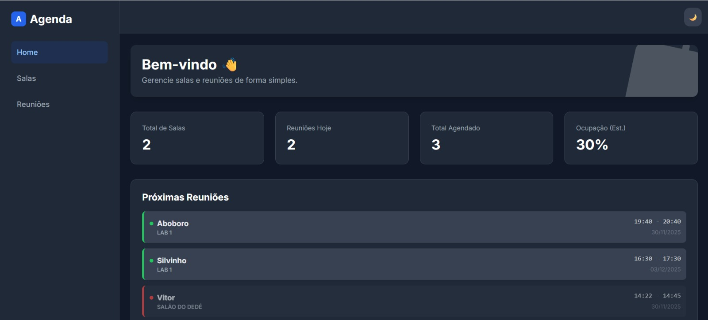
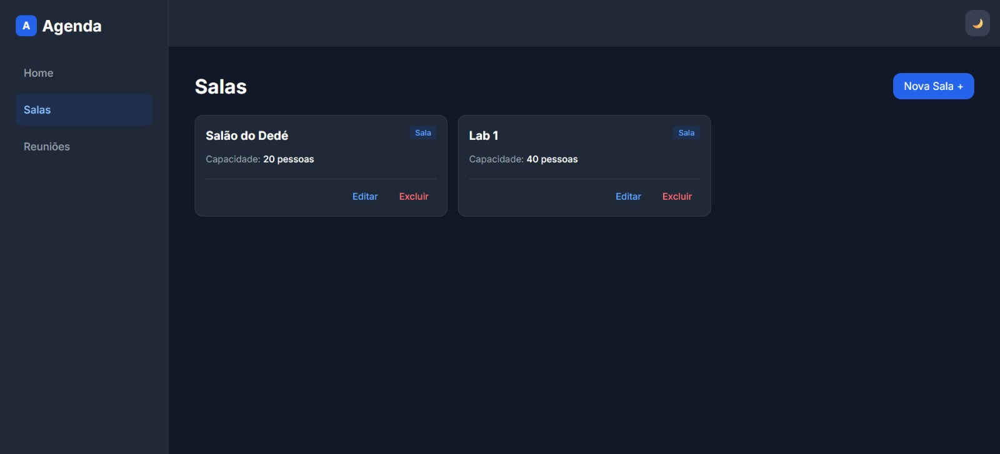
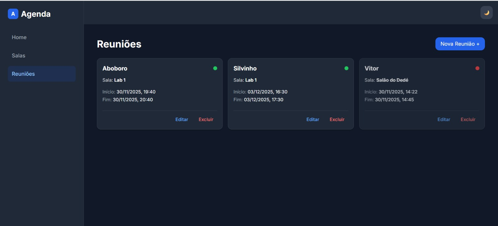

# 📅 Sistema de Agendamento de Salas e Reuniões


Projeto desenvolvido para a disciplina de **Sistemas Operacionais e Programação Web**. O sistema é uma aplicação Fullstack para gerenciamento de salas e agendamento de reuniões, com foco em usabilidade (UX), performance e containerização.





---

## 🚀 Tecnologias Utilizadas

O projeto utiliza uma arquitetura moderna baseada em MVC e containers:

### Backend
- **Node.js (NestJS)**: Framework robusto para a API REST.
- **Prisma ORM**: Gerenciamento de banco de dados e tipagem segura.
- **PostgreSQL**: Banco de dados relacional.
- **Docker**: Containerização da aplicação e banco.

### Frontend
- **React + Vite**: Interface rápida e reativa.
- **TypeScript**: Segurança de tipos no desenvolvimento.
- **Tailwind CSS**: Estilização moderna e responsiva.
- **Dark Mode**: Suporte nativo a tema claro e escuro.

---

## ✨ Funcionalidades

- **Dashboard Interativo**:
  - Métricas em tempo real (Total de salas, reuniões agendadas, ocupação).
  - Lista de próximas reuniões com ordenação inteligente (reuniões passadas vão para o fim da fila).
  - Indicadores visuais de status (🟢 Futuro / 🔴 Passado).
  
- **Gerenciamento de Salas (CRUD)**:
  - Criação, edição e exclusão de salas.
  - Definição de capacidade.

- **Agendamento de Reuniões (CRUD)**:
  - Agendamento com validação de horário (início e fim).
  - Associação automática com salas existentes.
  - Visualização clara de intervalos de tempo.

---

## 📦 Como Rodar o Projeto (Modo Docker)

Este é o método recomendado, pois sobe todo o ambiente (Banco + Back + Front) automaticamente.

### Pré-requisitos
- Docker instalado.

### Passo a Passo

1. **Clone o repositório:**

   ```bash
   git clone (https://github.com/vitorhhiguchi/agendamento.git)
   cd agendamento
   ```
2. **Suba os containers: Em cada diretório do projeto(backend-salas e frontend), execute:**

    ```bash
    docker compose up --build
    ```
3. **Acesse a aplicação:**
    - Frontend: http://localhost:5173
    - Backend API: http://localhost:3000
    - Banco de Dados: Porta 5432

---

### 🛠️ Como Rodar Localmente (Modo Desenvolvimento)

Caso prefira rodar sem Docker ou precise debugar:

1. **Banco de Dados**

Certifique-se de ter um PostgreSQL rodando e configure o arquivo .env na pasta backend-salas.

2. **Backend**

    ```bash
    cd backend-salas
    npm install
    npx prisma generate
    npm run start:dev
    ```

3. **Frontend**

    ```bash
    cd frontend
    npm install
    npm run dev
    ```

---

### 👥 Autores

Trabalho desenvolvido pela equipe:

* **Vitor Hiroshi Higuchi** - *Desenvolvedor* - [@vitorhhiguchi](https://github.com/Vitorhhiguchi)
* **Ananda** - *Desenvolvedor* - [@ananda]
* **Danilo** - *Desenvolvedor* - [@danilo]
* **Ozeias** - *Desenvolvedor* - [@ozeias]